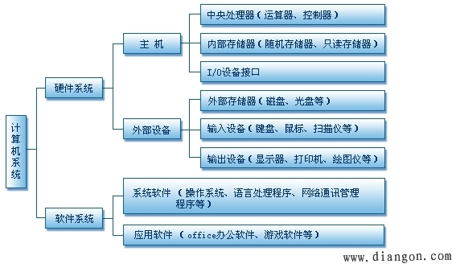

# 计算机基础知识

##  计算机发展史
 分代标准：计算机（数字电子计算机）的分代标准通常是计算机所采用的基本器件类型。

### 1. 第一代计算机（1946—1958）
  计算机使用电子管作为基本器件，程序系统使用机器语言，尚无软件概念，没有操作系统。

### 2. 第二代计算机（1958—1964）
  计算机使用晶体管作为基本器件。出现多种高级语言和单道批处理系统。
### 3. 第三代计算机（1964—1971）
  计算机使用中小规模集成电路作为基本器件。出现了多道批处理系统和分时系统以及数据库等新技术。
### 4. 第四代计算机（1971至今）
  计算机使用大规模、超大规模集成电路作为基本器件，并分别向大型机和微型机两个方向发展。
## 计算机系统组成
### 1. 硬件组成
冯诺依曼结构：由运算器、控制器、存储器、输入设备、输出设备五大部分组成。其中运算器和控制器组成CPU。

特点：程序指令与数据同存与同一存储器中。

哈佛结构：由CPU，程序存储器；（3）数据存储器三大部分组成。
特点：程序指令和数据分开存储
### 2. 软件组成
系统软件：操作系统（Windoms Linux Unix 三大主流操作系统） 语言处理系统 
应用软件：Office QQ Wechat 游戏软件 
## 计算机系统组成图解



```Python

